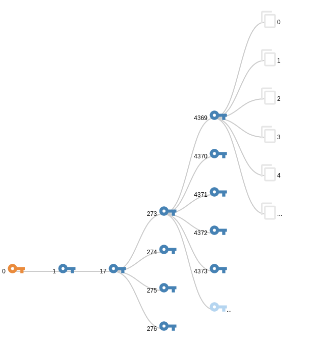

# SDOS
The Secure Delete Object Store

The Secure Delete Object Store (SDOS) implements a key management mechanism that enables cryptographic deletion of objects. 
SDOS is implemented as an API proxy for the Swift object store from the OpenStack project. 
SDOS can be used with any unmodified Swift client and server.

# demo-deployment
deployment automation for the whole system can be found at:

[https://github.com/sdos/deploy-sdos](https://github.com/sdos/deploy-sdos)

# Features
- client and server support for Swift REST protocol
- transparent proxy operation between any swift client/server
- content encryption and secure deletion configurable per container
- pseudo-object API allows SDOS related special requests within the Swift protocol
- different cascade geometries per container
- different master-key security per container
    - master key wrapped by static testing key
    - master key wrapped by user defined pass phrase
    - master key wrapped by Trusted Platform Module (TPM)
- multithreaded operation of key cascade
- caching for nodes and object mapping
- extensive logging/debugging

## How to use
Always run the `setenv.sh` script first to set the pythonpath and virtual environment. 
Then you can either manually run one of the test/experimental classes:

    . setenv.sh
    
    python mcm/sdos/tester/PerfTest.py
    python mcm/sdos/tester/GeomTest.py
    ...

or start a service that offers the Swift API proxy to which your Swift clients can connect:
    
    . setenv.sh
    python runService_Development.py
    
    
### configuration
is currently done by setting parameters in

     mcm/sdos/configuration.py

## Dev setup
### first setup after new checkout
make sure to specify a python 3 or higher interpreter for your virtualenv (SDOS doesn't support python 2)
in the main directory

    virtualenv venvSDOS
    . setenv.sh
    (included in setenv) source venvSDOS/bin/activate
    pip install -r requirements.txt
    

 
to leave venv

    deactivate
  
    
### use pip to install requirements
just install the existing reqs

    pip install -r requirements.txt
    
install new packages

    pip install <package>

save new packages to requirements:

    pip freeze --local > requirements.txt
    
    
update existing packages

    pip freeze --local | grep -v '^\-e' | cut -d = -f 1 | xargs pip install -U
    pip freeze --local > requirements.txt